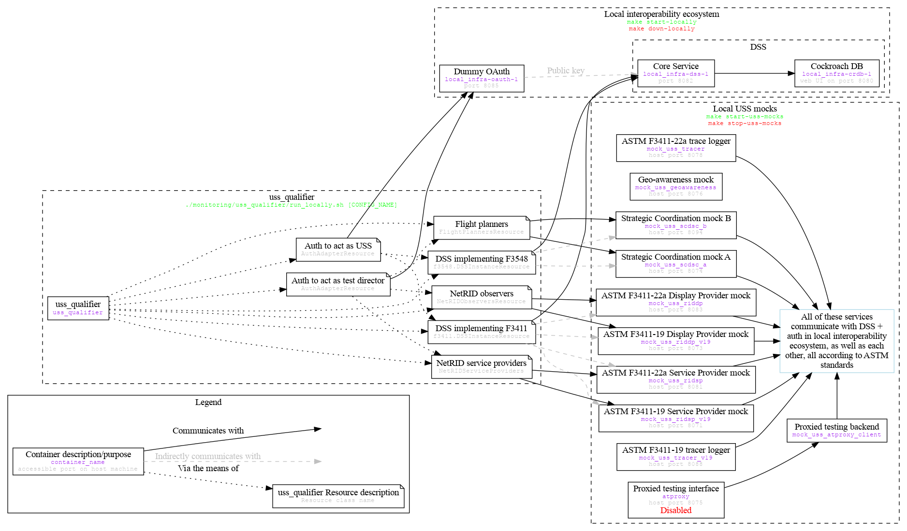

# uss_qualifier local testing

This repository contains tools to enable a user to run most uss_qualifier tests entirely on their local machine by mocking all the components necessary for those tests.  This page describes how to do this.

Note that this page assumes the root repository folder is the current working directory.

## Local interoperability ecosystem infrastructure

Most mock systems depend on a standards-compliant interoperability ecosystem in which to operate.  For ASTM F3411 and F3548, the infrastructure necessary for this interoperability ecosystem is an OAuth provider and a DSS instance.  The tool to deploy this infrastructure locally and validate that it was deployed successfully is located [here](../../build/dev).

To deploy a local interoperability ecosystem: `make start-locally`

To determine the status of a local interoperability ecosystem, run `docker container ls` and inspect the results for the three containers constituting the ecosystem (see diagram above).

To tear down a local interoperability ecosystem: `make down-locally`

## Local USS mocks

Different uss_qualifier scenarios test and depend on different types of USSs.  However, rather than trying to identify which tests need which mock USSs, this repository provides a standard deployment of many mock_uss instances that should satisfy the needs of most uss_qualifier tests.

Note that this deployment will need to be restarted to incorporate any changes to mock implementations.

To deploy the complete set of local mocks, first deploy local interoperability ecosystem infrastructure and then: `make start-uss-mocks`

To start only a selection of mock uss servers, `COMPOSE_PROFILES` environment variable can be used. See [mock uss docker-compose.yaml file](../mock_uss/docker-compose.yaml) to
find the available profiles.
Example: `COMPOSE_PROFILES=scd,rid make start-uss-mocks` will start the containers in profiles scd and rid. If the variable is not provided, all containers will start.
Note that all containers must start and therefore must contain the `''` profile.

To determine the status of a complete set of local mocks, run `docker container ls` and inspect the results for the mock containers (see diagram above).  Or, bring the system to a known state by tearing down the complete set of local mocks and then redeploying it.

To tear down the complete set of local mocks (or ensure it is completely torn down): `make stop-uss-mocks`

## Testing with local deployments

Once the local interoperability ecosystem infrastructure and complete set of local mocks are deployed, execute uss_qualifier with [`./monitoring/uss_qualifier/run_locally.sh [CONFIG_NAME]`](run_locally.sh).  If no `CONFIG_NAME` is specified, all configurations used for the [continuous integration](../../.github/workflows) are executed; this involves multiple invocations of uss_qualifier.  Otherwise, a specific [configuration name](configurations/README.md#specifying) can be specified; e.g., [`configurations.dev.uspace`](configurations/dev/uspace.yaml).

To cause uss_qualifier to stop at the first test failure (this is often useful when attempting to debug a test that should run fully successfully), set the `stop_fast` flag in the `execution` portion of the configuration.

## Presubmit testing

The command `make presubmit` will perform local actions equivalent to the full [continuous integration pipeline](../../.github/workflows) including, relevant to local testing:

* Tear down any existing local interoperability ecosystem infrastructure
* Bring up local interoperability ecosystem infrastructure
* Tear down any existing local mocks
* Bring up complete set of local mocks
* Run uss_qualifier for each [CI-relevant](run_locally.sh) configuration
* Tear down local mocks
* Tear down local interoperability ecosystem infrastructure
