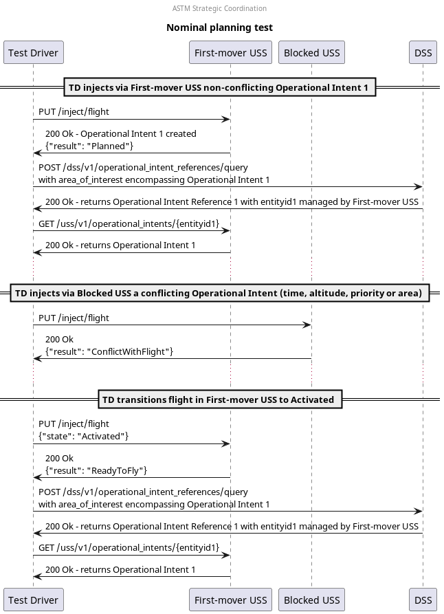

# Nominal planning test scenario

## Overview

This test approximates normal strategic coordination where a user successfully
plans a flight whose operational intent is shared with other USSs, and where a
user cannot plan a flight because it would conflict with another operational
intent.

## Sequence

## Resources

### flight_intents
FlightIntentsResource that provides at least 2 flight intents:
- Flight 1: used for the successfully-planned flight
  - Mutations:
    - `activated`: state mutation `Activated`
- Flight 2: used for the failed flight
  - must intersect flight 1

### uss1

FlightPlannerResource that will successfully plan the first flight.

### uss2

FlightPlannerResource that will unsuccessfully attempt to plan the second flight.

### dss

DSSInstanceResource that provides access to a DSS instance where flight creation/sharing can be verified.

## Setup test case

### Check for necessary capabilities test step

Both USSs are queried for their capabilities to ensure this test can proceed.

#### Valid responses check

If either USS does not respond appropriately to the endpoint queried to determine capability, this check will fail.

#### Support BasicStrategicConflictDetection check

If either USS does not support BasicStrategicConflictDetection, then this check will fail per **[astm.f3548.v21.GEN0310](../../../../requirements/astm/f3548/v21.md)** as the USS does not support the InterUSS implementation of that requirement.

### Area clearing test step

Both USSs are requested to remove all flights from the area under test.

#### Area cleared successfully check

**[interuss.automated_testing.flight_planning.ClearArea](../../../../requirements/interuss/automated_testing/flight_planning.md)**

## Plan first flight test case

### [Plan flight intent test step](../../../flight_planning/plan_flight_intent.md)

The first flight intent should be successfully planned by the first flight planner.

### [Validate flight sharing test step](../validate_shared_operational_intent.md)

## Attempt second flight test case

### [Plan second flight with non-permitted equal priority conflict test step](../../../flight_planning/plan_conflict_flight_intent.md)

The second flight intent conflicts with the first flight that was already planned.  If the USS successfully plans the flight, it means they failed to detect the conflict with the pre-existing flight.

## Activate first flight test case

In this step, the first USS successfully executes a user intent to activate the first flight.

### [Activate first flight test step](../../../flight_planning/activate_flight_intent.md)

The first flight intent should be successfully activated by the first flight planner.

### [Validate flight sharing test step](../validate_shared_operational_intent.md)

## Cleanup

### Successful flight deletion check

**[interuss.automated_testing.flight_planning.DeleteFlightSuccess](../../../../requirements/interuss/automated_testing/flight_planning.md)**
